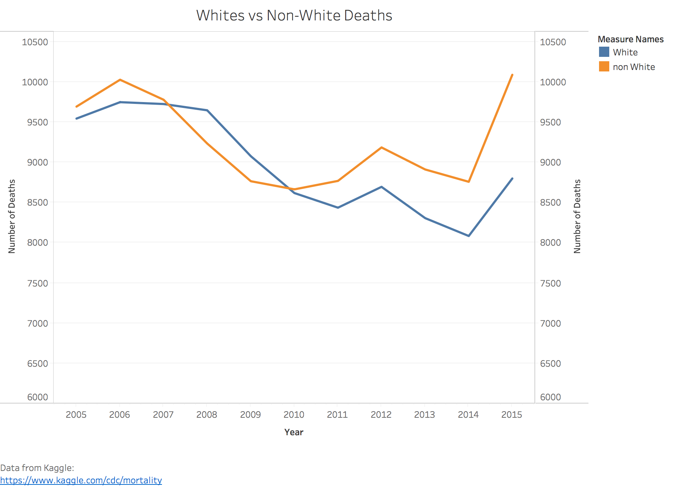
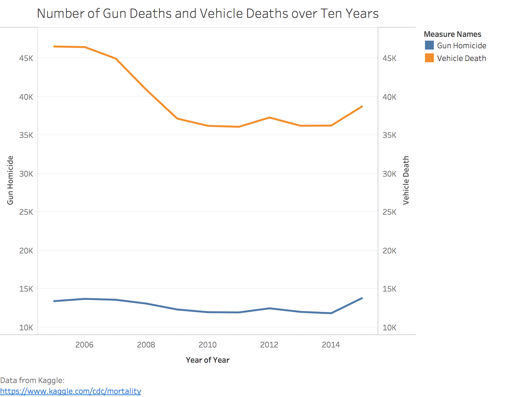

# Guns and White People Are Not Special Cases When Considering Other Causes of Death

Reading the original article, the messages I got from the author were that:
* Whites face a much bigger threat of death by guns than blacks do
* Gun deaths happen more frequently than vehicle deaths

Well, I don't see the same problems when arranging the data by year and including other races in the population other than blacks and whites.

There has always been more non-white deaths than white deaths as the years go by. Taking into account all possible methods of death, whites are not dying at a faster rate than other races.

Vehicle deaths happen much more frequently than gun deaths, and the death rates of each have remained the same. Maybe vehicle laws or traffic law enforcement practices need revamping more than gun laws do.

I have excluded gun suicides from gun deaths, because if someone wanted to commit suicide, a gun is just one of many options, while on the other hand gun homicide victims have no choice in how they die. Vehicle deaths include land vehicles and motorcycles. Air and water vehicles are disregarded because when most people think of death by vehicle, they think of cars and other methods of transportation by land. In this country most citizens have substantially easier access to land vehicles than air and water vehicles anyways.

## Non-Deceptive (Truthful) Versions of Charts

I wanted to hide the years earlier than 2010, because more whites than non-whites died in those years. If my opposition saw that, they would argue that there is a history of whites facing more danger than non-whites, so if it has been a problem before, it could be a problem again.

I hid the data from 2009 and earlier years, because those years show a sudden drop in the number of vehicle deaths. If seen by my opposition, they can argue that if vehicle deaths are dropping while gun deaths stay the same, gun deaths will surpass vehicle deaths in the future, so guns really are a bigger problem than vehicles.
