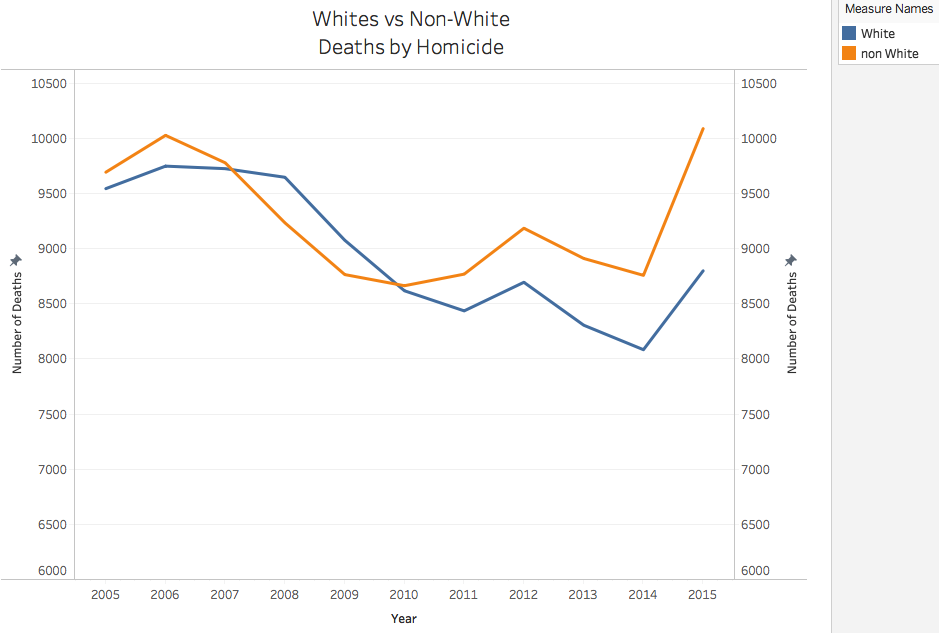
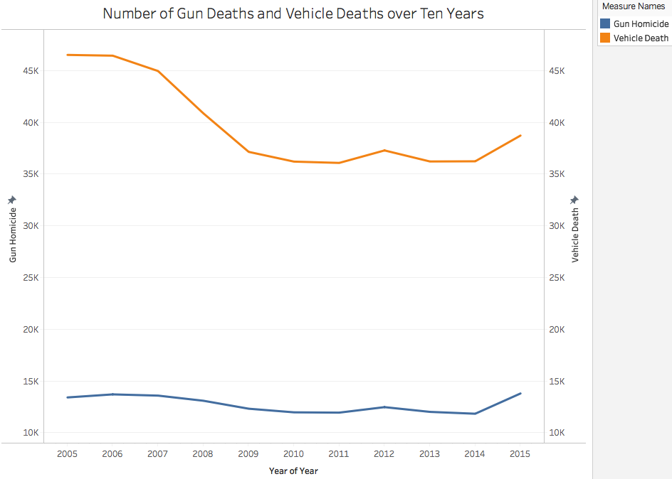

# Guns and White People Are Not Special Cases When Considering Other Causes of Death

Reading the original article, the messages I got from the author were that:
* Whites face a much bigger threat of death by guns than blacks do
* Gun deaths happen more frequently than vehicle deaths

Well, I don't see the same problems when arranging the data by year and including other races in the population other than blacks and whites.

Non-white deaths are surpassing white deaths as the years go by. Whether or not guns are involved isn't the problem, and whites are not dying at any faster rate compared to other races.

Vehicle deaths happen much more frequently than gun deaths. Maybe vehicle laws or traffic law enforcement practices need revamping more than gun laws do.
