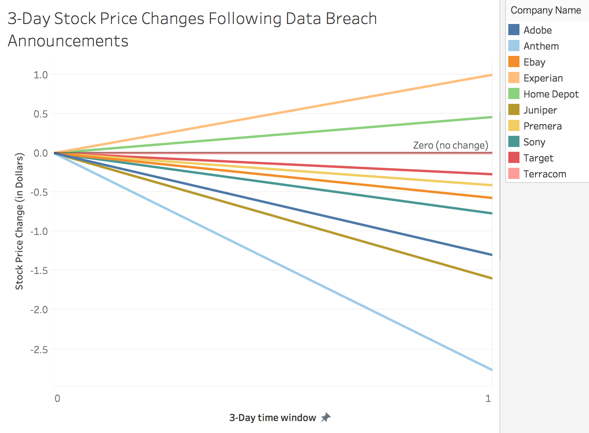

# Lab 7 (Lab 3 Redesign)

### Support / Refute the following claim: "Financial markets punish security breaches"

In the previous attempt, my data only contained year of data breach, and nothing more specific. I decided that number of records lost, data sensitivty of lost records, method of leak and organization type are all irrelevant. The one fact that is of primary concern is that a company is breached, and that fact alone is enough to trigger stock market fluctuations.

I decided to find another dataset that contained exact dates the companies announced they have been breached, so I can track stock price changes immediately following announcement. Close values of each stock price trading day are used. Price change (in Dollars) is measured between the day a company announces the breach and 3 days after the announcement.

I visualized rise and drop in stock prices with line slopes. Viewers can see that the lines tend to have negative slopes than positive.

Stock prices can both rise and fall after a data breach announcement, but more likely they will drop slightly. This visual does not take into account that stock changes can be affected by a variety of factors, not just data breaches, so one can easily refute the original claim that financial markets punish security breaches.

I understand that 13 companies, all in different industries with different dates of breach, are not representative of all industries and years overall. I used this dataset simply because I wanted to see immediate price changes following data breach announcements. Whether the actual stock price of each company after announcement of breach is still considered good/bad compared to industry competition is unknown here.

So do financial markets punish security breaches? Yes, they can. But many other factors unexplained by stock price changes alone can make a stock price rise anyways, amidst a security breach announcement. Maybe shareholders see lots of positive characteristics of a company that outweigh its negative characteristics?
