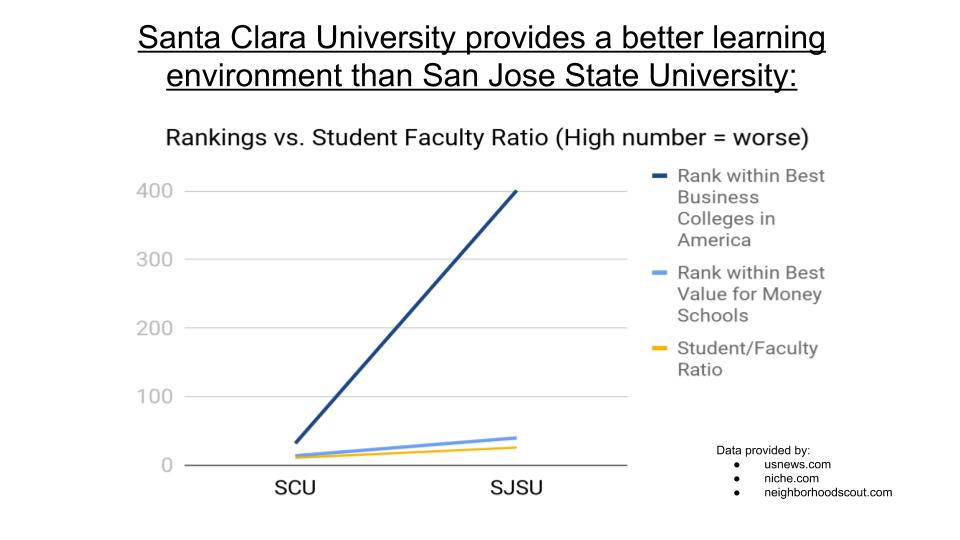

# MSIS Program Fact Sheet

When searching for and applying to schools and their programs of study, students have many factors and criteria to consider, including:
* School prestige / rankings
* Job titles graduates hold from specific programs
* Geographic environment
* Professor / staff quality
* School population

I have decided to compare Santa Clara University against San Jose State University, because both schools are located close together and hold relatively good reputations among other schools nationwide, so many applicants would be cross comparing these two schools. Details I have decided to display to applicants are:
* Overall Rankings
* Student/faculty ratio
* City crime rates

It's easy to look at academic excelence when comparing schools, so it's easy to forget about lifestyle and quality of life when choosing a college. Prestige is pointless if class sizes are too big to give each student the proper student/teacher communication for effective learning, and a high crime rate would shift students' focus away from studying.  Both SCU and SJSU are located in Silicon Valley and offer programs fully capable of preparing students to join Silicon Valley's workforce, so I will disregard specific career details and focus on non-academic aspects of college life.

With such limited space (one page) this fact sheet needs to be understandable to the audience from first glance and minimal thinking required to realize the message. I realized that in the previous attempt of this fact sheet I did not explain the rankings properly, as the rank titles are specific. I could either choose different ranking titles easier to understand, or explain the current titles I've used.

Rankings I previously used were:
* Best in regional universities west
* Best value schools

Those were confusing to anyone who didn't know the ranking's details or meanings, so I changed them to:
* Best for Business in America
* Best value for money schools

Which are titles understandable to anybody reading. Any further details they'd like to know, they can find from the sources I listed in the fact sheet.

Here is one draft:

Here is the same thing with integrated data:

