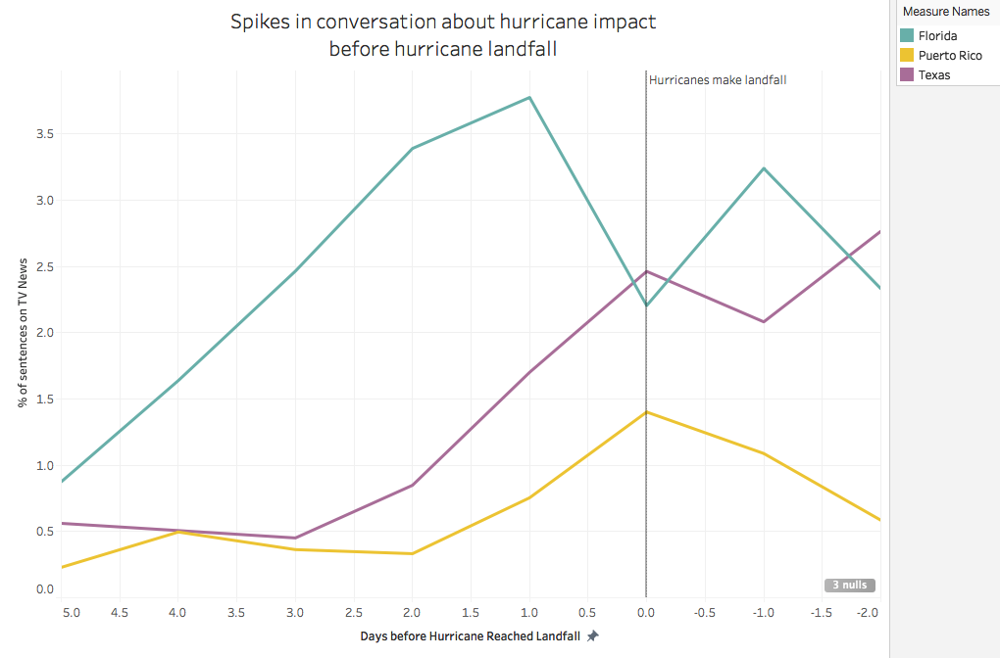
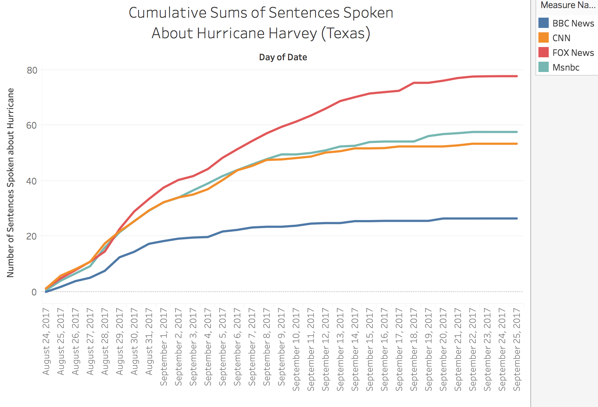
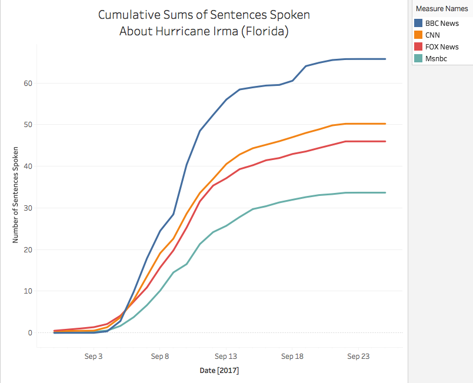
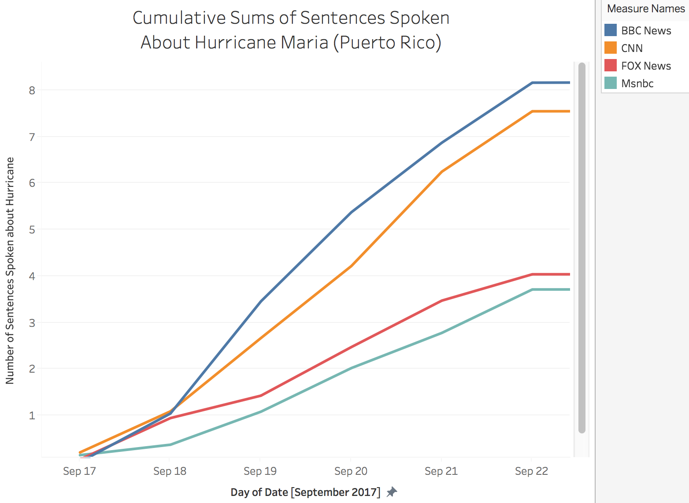

# The Media has neglected Puerto Rico during their Hurricane Crisis (Redesign)

It seems that most Americans do not give Puerto Rico the same amount of attention commonly given to other US territories.
This is made apparent by measure of the amount of attention given to Puerto Rico during its hurricane crisis versus the attention given to Texas and Florida.

